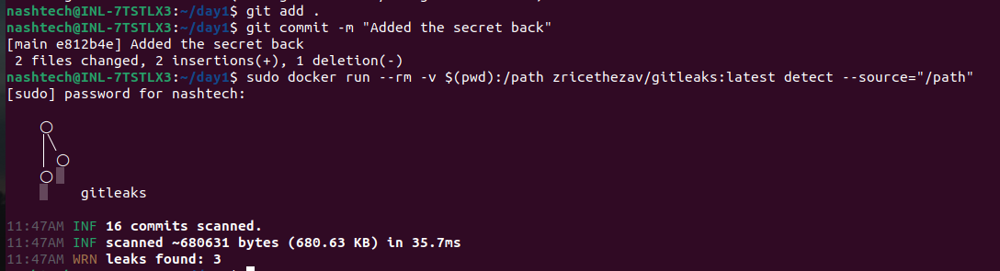
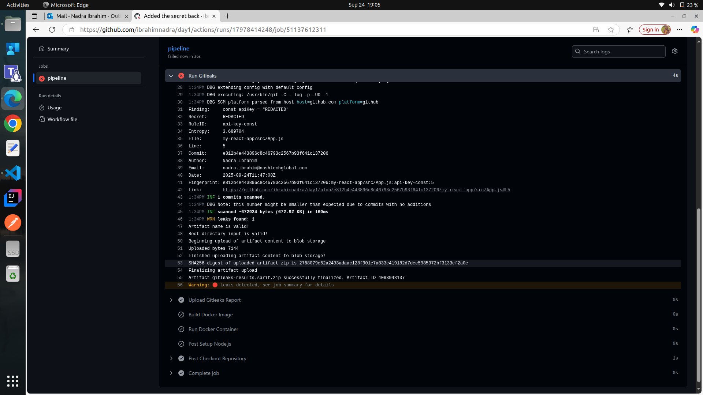
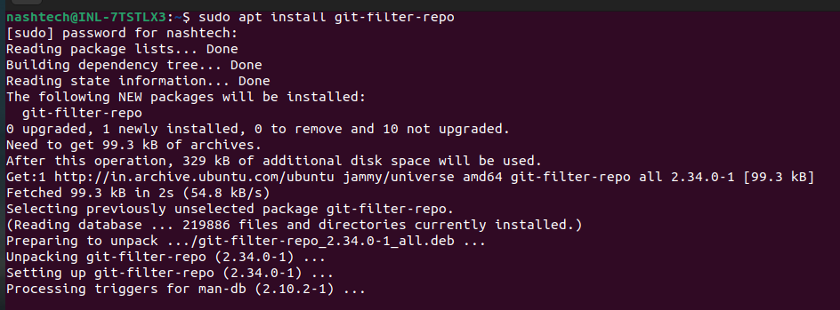
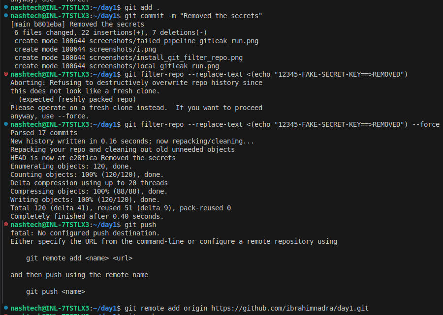

# Exercise for Day 1:  Introduction to DevSecOps & Shift-Left Security

## Objective
Demonstrate understanding of shift-left security principles by scanning code for secrets, safely removing them, and deploying an application securely.

---

## Tasks Completed

### 1. Use a Sample Code
- A simple React application (`my-react-app`) was used as the sample codebase, which is exposing a secret: apiKey in App.js.

### 2. Created the ruleset for Gitleaks
- Created a custom `gitleaks.toml` configuration file to define patterns for detecting secret: apiKey.

### 3. Set up Gitleaks locally
- Pulled the image from dockerhub: `docker pull zricethezav/gitleaks:latest`.
- Added and Committed the day1 folder to a new GitHub repository.
- Ran Gitleaks locally using:
  ```bash
  docker run --rm -v $(pwd)/.gitleaks.toml:/gitleaks.toml -v $(pwd):/code zricethezav/gitleaks:latest
  ```
- Verified that Gitleaks detected the hardcoded secrets.
  

### 4. Set up Gitleaks in a Pipeline
- Added a GitHub Actions workflow under `.github/workflows/react-devsecops.yml`.
- Integrated **Gitleaks** (`zricethezav/gitleaks-action@v2`) to scan the repo for hardcoded secrets.
- Configured it to generate a report (`gitleaks-report.json`) and upload it as an artifact.
  

### 5. Install `git-filter-repo`
- Installed using apt package manager:
  ```bash
  sudo apt install git-filter-repo
  ```
  

### 3. Identify and Remove Detected Secrets
- Removed the secret from the codebase (App.js).
- Removed the secret from the Git history using:
  ```bash
  git filter-repo --replace-text <(echo "REMOVED==>REMOVED")
  ```
- Committed and pushed the changes to GitHub.
  

### 4. Re-run Gitleaks
- Re-scanned the repository to ensure no further secrets were detected.
- Verified that the Gitleaks report was clean.

### 5. Deploy Application Securely
- Wrote a `Dockerfile` to containerize the React application.
- Extended the GitHub Actions pipeline with four stages:
  1. **Build**: Install dependencies and build the React app.
  2. **Test**: Placeholder test (echo statement).
  3. **Security**: Run Gitleaks and upload the scan report.
  4. **Deploy**: Build and run the Docker container.

---

## Pipeline Workflow
The CI/CD pipeline ensures:
- Early detection of secrets before they reach production.
- Automated build and deployment of the application inside Docker.
- Artifacts for audit purposes (Gitleaks report).

---

## Lessons Learned
- Secrets can accidentally get hardcoded and pushed to source control.
- Automated scanning tools like **Gitleaks** help shift security left by catching issues early.
- Deployment should always avoid including sensitive values in code. Secrets must be injected securely (via env vars, secret stores, or config managers).

---

## Core Concept Questions

### 1. Explain the concept of shift-left security and why it is important in DevSecOps.
Shift-left security means integrating security practices earlier in the software development lifecycle. Instead of testing for vulnerabilities only after deployment, developers and pipelines catch issues during coding, building, and testing phases. This reduces cost, speeds up delivery, and prevents security flaws from reaching production.

### 2. How does detecting secrets early in the CI/CD pipeline prevent production vulnerabilities?
Secrets like API keys, passwords, or tokens in source code can lead to breaches if exposed. Detecting them early stops compromised builds from being deployed, preventing attackers from accessing sensitive systems or data.

### 3. What strategies can be used to store secrets securely instead of hardcoding them?
- Use environment variables.
- Store secrets in secret management tools (e.g., HashiCorp Vault, AWS Secrets Manager, Azure Key Vault, Kubernetes Secrets).
- Use `.env` files but ensure they are excluded with `.gitignore`.
- Rotate secrets regularly.

### 4. Describe a situation where a secret could still be exposed even after scanning, and how to prevent it.
Even after running Gitleaks, some secrets might **not be detected** if:  
- They are **in a format or pattern not defined in the Gitleaks rules (`toml` file)**.  
- They are stored in **non-standard files** or obfuscated in the code.  

**Example:**  
I have hardcoded a custom API key in a `.js` file, and your Gitleaks config doesn’t have a regex to detect that pattern, it won’t be flagged.  

**Prevention strategies:**  
1. **Update Gitleaks configuration**: Add custom rules in your `gitleaks.toml` to match any secret patterns your project uses.  
2. **Use secret management**: Avoid hardcoding secrets entirely; use environment variables, secret stores, or config managers.  
3. **Manual review for sensitive areas**: Critical files (configs, scripts) can be double-checked by peers.  

---
